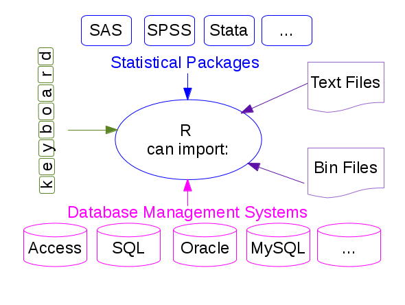

*************************
Data Reading and Writting
*************************

.. highlight:: r

You can import data in R in many different formats!

.. _fromASCII:

ASCII data files
================

The main functions used in R to import data from ASCII files are ``read.table``
and ``read.csv`` to read data in a tabular form, and ``readLines`` to read
lines from a text file. The only difference between ``read.table`` and
``read.csv`` is that in the later the default separator is a comma.  The
analogous functions to write data to a text file are called ``write.table``,
``write.csv``, ``writeLines``,... 

Let's have a file named :download:`galaxies.dat <galaxies.dat>`, which contains:

.. code-block:: ini

  GALAXY morf T_RC3 U-B B-V
  NGC1357 Sab 2    0.25 0.87
  NGC1832 Sb  4   -0.01 0.63
  NGC2276 Sc  5   -0.09 0.52
  NGC3245 S0 -2    0.47 0.91
  NGC3379 E  -5    0.53 0.96
  NGC1234 Sab 3   -0.56 0.84
  NGC5678 E  -4    0.45 0.92
  
This file can be read as follows:

.. code-block:: r

   > gal <- read.table("galaxies.dat",header=TRUE)
  
where the instruction ``header=TRUE`` specifies that the first line in the file
does not contain data but it is a label identifying the contents of every
column.

.. code-block:: r

   > gal				# show content of data file
      GALAXY morf T_RC3   U.B  B.V	# 'U-B' and 'B-V' labels have changed!
   1 NGC1357  Sab     2  0.25 0.87
   2 NGC1832   Sb     4 -0.01 0.63
   3 NGC2276   Sc     5 -0.09 0.52
   4 NGC3245   S0    -2  0.47 0.91
   5 NGC3379    E    -5  0.53 0.96
   6 NGC1234  Sab     3 -0.56 0.84
   7 NGC5678    E    -4  0.45 0.92

The data file is read as a data frame (i.e. a list):

.. code-block:: r

   > class(gal)
   [1] "data.frame"
   > names(gal)
   [1] "GALAXY" "morf"   "T_RC3"  "U.B"    "B.V" 
    
   > gal$morf
   [1] "Sab" "Sb"  "Sc"  "S0"  "E"
   
   > tapply(gal$U.B, gal$morf, mean)    # calculate mean colours for every morph. type
       E     S0    Sab     Sb     Sc 
   0.490  0.470 -0.155 -0.010 -0.090 
 
The names of the different fields can be directly accessed (without lists name
specification) using their names:

.. code-block:: r

   > attach(gal)			# direct access to the list elements
   > morf                               #   (it is no longer necessary to use gal$morf,...)
   [1] Sab Sb  Sc  S0  E  
   Levels: E S0 Sab Sb Sc
    
   > detach(gal)			# remove direct access

    
If the data file only contains numbers, information can also be read and
assigned to a matrix instead of storing it in a data frame. As an example, if
we want to read the file :download:`numbers.dat <numbers.dat>` with 3 columns:

.. code-block:: r

   > a <- matrix(data=scan("numbers.dat",0), ncol=3, byrow=TRUE)
   Read 36 items
   > a
         [,1]  [,2] [,3]
    [1,]    2  0.25 0.87
    [2,]    4 -0.01 0.63
    [3,]    5 -0.09 0.52
    [4,]   -2  0.47 0.91
    [5,]   -5  0.53 0.96
    [6,]    1  0.45 0.92
    [7,]    3  0.20 0.73
    [8,]   -3  0.51 0.94
    [9,]   -5  0.55 0.96
   [10,]   10 -0.22 0.39
   [11,]   -1  0.38 0.85
   [12,]    5 -0.03 0.63

If the number of columns is not specified through ``ncol``, all the elements are stored into a one dimensional array:

.. code-block:: r

   > a1 <- matrix(data=scan("numbers.dat",0))
   Read 36 items
   > a1
          [,1]
    [1,]  2.00
    [2,]  0.25
    [3,]  0.87
    [4,]  4.00
    [5,] -0.01
    [6,]  0.63
    [7,]  5.00
    [8,] -0.09
    [9,]  0.52
     .     .
     .     .
     .     .
   [28,] 10.00
   [29,] -0.22
   [30,]  0.39
   [31,] -1.00
   [32,]  0.38
   [33,]  0.85
   [34,]  5.00
   [35,] -0.03
   [36,]  0.63

If ``byrow=TRUE`` is omitted the element assignment does not preserve the
columns information:

.. code-block:: r

   > a2 <- matrix(data=scan("numbers.dat",0), ncol=3)
   Read 36 items
   > a2
          [,1]  [,2]  [,3]
    [1,]  2.00 -5.00 -5.00
    [2,]  0.25  0.53  0.55
    [3,]  0.87  0.96  0.96
    [4,]  4.00  1.00 10.00
    [5,] -0.01  0.45 -0.22
    [6,]  0.63  0.92  0.39
    [7,]  5.00  3.00 -1.00
    [8,] -0.09  0.20  0.38
    [9,]  0.52  0.73  0.85
   [10,] -2.00 -3.00  5.00
   [11,]  0.47  0.51 -0.03
   [12,]  0.91  0.94  0.63

.. note:: Reading large datafiles requires a careful setting of the read.table parameters. Specifying the "colClasses" argument can make the data reading twice as fast while setting the "nrows" argument helps with the memory usage. 
  
.. _exampleData:

R Example Data
==============

R contains a lot of example data. All the functions and data blocks are stored in packages.

The list of packages currently installed in R can be seen with:

.. code-block:: r
   :class: no-copybutton

   > library()
   Packages in library ‘/home/user/R/x86_64-redhat-linux-gnu-library/3.0’:
    
   FITSio                  FITS (Flexible Image Transport System) utilities
   manipulate              Interactive Plots for RStudio
   plyr                    Tools for splitting, applying and combining  data
   rstudio                 Tools and Utilities for RStudio
    
   Packages in library ‘/usr/lib64/R/library’:
    
   base                    The R Base Package
   bitops                  Functions for Bitwise operations
   boot                    Bootstrap Functions (originally by Angelo Canty for S)
   class                   Functions for Classification
   ...
  
To gather information about a specific package:

.. code-block:: r
   :class: no-copybutton

   > library(help=splines)		# show help about the 'splines' package
    
                 Information on package ‘splines’
   
   Description:
   
   Package:       splines
   Version:       3.0.1
   Priority:      base
   Imports:       graphics, stats
   Title:         Regression Spline Functions and Classes
   Author:        Douglas M. Bates <bates@stat.wisc.edu> and William N.
                  Venables <Bill.Venables@csiro.au>
   Maintainer:    R Core Team <R-core@r-project.org>
   Description:   Regression spline functions and classes
   ...  
  
And to load a package and be able to use its functionality:

.. code-block:: r

   > library(splines)			# load 'splines' package
  
We can check the data lists that are currently available:

.. code-block:: r
   :class: no-copybutton

   > data()
   Data sets in package ‘datasets’:
   
   AirPassengers           Monthly Airline Passenger Numbers 1949-1960
   BJsales                 Sales Data with Leading Indicator
   BJsales.lead (BJsales)  Sales Data with Leading Indicator
   BOD                     Biochemical Oxygen Demand
   CO2                     Carbon Dioxide Uptake in Grass Plants
   ChickWeight             Weight versus age of chicks on different diets
   DNase                   Elisa assay of DNase
   EuStockMarkets          Daily Closing Prices of Major European Stock
   ...
  
And those that are available in a given package:

.. code-block:: r
   :class: no-copybutton

   > data(package="cluster")		# show data available through the package 'cluster'
   
   Data sets in package ‘cluster’:
    
   agriculture             European Union Agricultural Workforces
   animals                 Attributes of Animals
   chorSub                 Subset of C-horizon of Kola Data
   flower                  Flower Characteristics
   plantTraits             Plant Species Traits Data
   ...
   
   > data(animals, package="cluster")	# load 'animals' list from 'cluster' package
  
One of the strongest points in R is that new packages are continuously being
generated, including new functionalities.  To install a new package:

.. code-block:: r
   :class: no-copybutton

   > install.packages("car")		# install 'car' package
   Installing package into ‘/home/ceballos/R/x86_64-redhat-linux-gnu-library/3.0’
   ...
    
   --- Please select a CRAN mirror for use in this session ---  # ask for a software mirror 
  
Once installed we can use it:

.. code-block:: r

   > library(car)			# load in memory the functionality defined in 'car'
   > data(package="cluster")
   Data sets in package ’car’:
   
   AMSsurvey 			American Math Society Survey Data
   Adler 			Experimenter Expectations
   ...
 
