*******
Graphs
*******
.. role:: bblue
.. highlight:: r

Graphics package
=================

The "base" 2-D graphics options in R are included in the base package **graphics** (``plot``, ``hist``, ``boxplot``, etc.):

* ``plot(x,y)`` and ``hist(x)`` open a new graphic device if there is not one already open. Defaults are ``x11`` for Unix, ``windows`` for Windows and ``quartz`` for Mac OS X.
* There are many parameters in these functions  that can be overridden using the ``par`` function. They are documented in ``?par``

::

  > par("pch")				# default plotting symbol (open circle)
  [1] 1                                
  > par(pch=2)				# change symbol (open triangle)
  
  > par("lty")				# default line type
  [1] "solid"
  > par("lwd")				# default line width
  [1] 1
  > par("col")				# default colour
  [1] "black"
  >  par("mfrow")			# default number of rows & columns (filled row-wise)
  [1] 1 1
  > par("mfcol")			# default number of rows & columns (filled column-wise)
  [1] 1 1

The plotting process will then be:

1. Set a graphics device

::

  > pdf(myfile.pdf,width=10.,height=7.1) 	# landscape output plot in PDF format
  > postscript(myfile.ps)			# PS output
  > png(myfile.png)				# PNG
  > jpeg(myfile.jpeg)				# JPG   
    
2. Make a plot (see main functions below)
::

  > plot(x,y)

3. Close device
::

  > dev.off()
  
Important Plotting Functions
=============================

:bblue:`plot`: this function makes scatterplots or other types of R objects plots

:bblue:`abline`: add a straight line to a plot

:bblue:`lines`: add connected line segments to a plot

:bblue:`segments`: add disconnected line segments to a plot

:bblue:`points`: add points to a plot

:bblue:`arrows`: add arrows to a plot

:bblue:`polygon`: add polygons to a plot

:bblue:`text`: add text labels to a plot

:bblue:`title`: add labels for *X,Y* axes, *title*, *subtitle*, *outer margin*

:bblue:`axis`: modify axes ticks and axes labels

Let's take the light velocity measures done by Michelson and Morley in their famous experiment. They performed 5 series 
(*Expt*) with 20 measures each (*Run*):

::
    
  > data(morley)			# data are in 'base' package loaded by default
  > morley
      Expt Run Speed
  001    1   1   850
  002    1   2   740
  003    1   3   900
  004    1   4  1070
  ...
  100    5  20   870

  
We can generate a histogram:

::

  > hist(morley$Speed, main="Speed of light measurements", 
  +      xlab="c-299000 km/s", ylab="frequency")

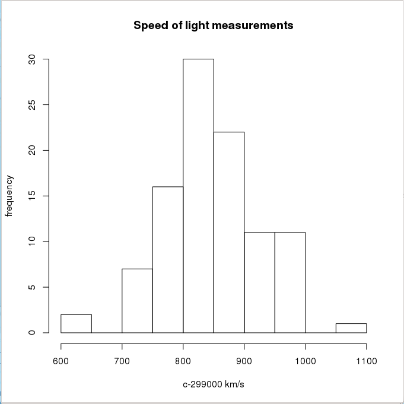

Or a scatter plot:

::

  > hip <- read.table("http://www.iiap.res.in/astrostat/tuts/HIP.dat",	# read web file
  +                    header=TRUE, fill=TRUE)	# fill=TRUE if some rows have missing values
  
  > names(hip)
  [1] "HIP"   "Vmag"  "RA"    "DE"    "Plx"   "pmRA"  "pmDE"  "e_Plx" "B.V"  	# show columns
  
  > plot(hip$B.V,hip$Vmag,ylim=c(13,0))		# scatter plot (black open circle points)
  > lines(c(-1,2.5),c(5,5), col="red")
  > points(c(1.5),c(2), pch=2, col="blue")
  > text(1.5,1.5, "Fake point", col="blue")
  > title(main="HR diagram", cex.main=1.5, col.main="magenta")
  > axis(1, col="violet")
  
  
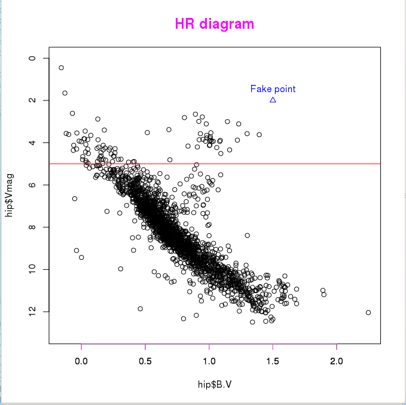

Let's analyse the distribution of star magnitudes we have just loaded. We will first  create a new list containing
only two components:

::

  > hipBmag <- hip$B.V + hip$Vmag			# calculate B magnitude as "B.V" + "Vmag"
  > newlist = list(V = hip$Vmag, B = hipBmag)   	# generate a new named list
  > names(newlist)					# show elements of the new list
  [1] "V" "B"
  > boxplot(newlist,horizontal=TRUE,			# create a "box-and-whiskers" plot
  + main="Magnitude Distribution",xlab="magnitude")
  
  
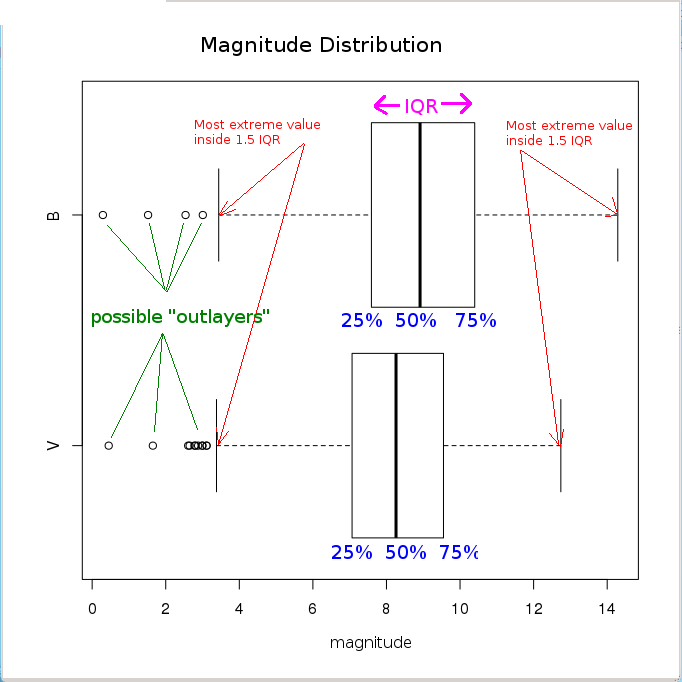

An example of time series: the monthly mean relative sunspot numbers from 1749
to 1983 (directly available in the package datasets):

::

  > sunspots
         Jan   Feb   Mar   Apr   May   Jun   Jul   Aug   Sep   Oct   Nov   Dec
  1749  58.0  62.6  70.0  55.7  85.0  83.5  94.8  66.3  75.9  75.5 158.6  85.2
  1750  73.3  75.9  89.2  88.3  90.0 100.0  85.4 103.0  91.2  65.7  63.3  75.4
  1751  70.0  43.5  45.3  56.4  60.7  50.7  66.3  59.8  23.5  23.2  28.5  44.0
    .     .     .     .     .     .     .     .     .     .     .     .     .
    .     .     .     .     .     .     .     .     .     .     .     .     .
    .     .     .     .     .     .     .     .     .     .     .     .     .
  1981 114.0 141.3 135.5 156.4 127.5  90.0 143.8 158.7 167.3 162.4 137.5 150.1
  1982 111.2 163.6 153.8 122.0  82.2 110.4 106.1 107.6 118.8  94.7  98.1 127.0
  1983  84.3  51.0  66.5  80.7  99.2  91.1  82.2  71.8  50.3  55.8  33.3  33.4

  > png("sunspots.png", width=800, height=400)  # define output to PNG file
  > plot(sunspots)                              # plot time series
  > dev.off()                                   # close PNG file
  null device
            1

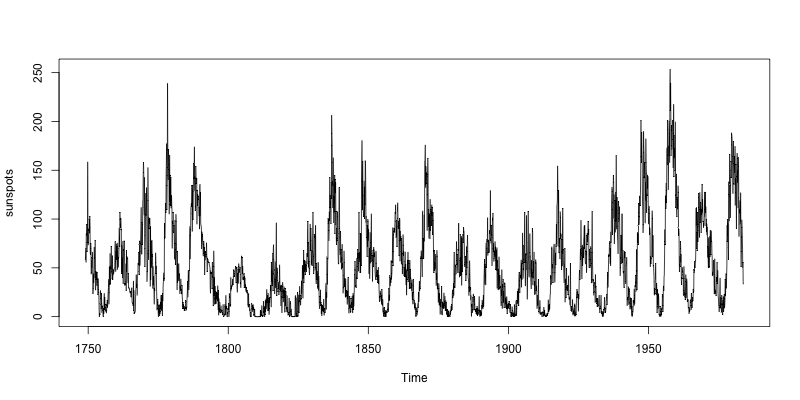

Simple plots
============

Although R provides high-level graphics facilities, these tools are built on 
a set of flexible low-level functions, which sometimes constitute a more
flexible approach when creating plots:

::

  # define function to be plotted
  > x <- seq(-3,3,length=100)
  > y <- x**3

  > plot.new()                                  # a new plot is created
  > plot.window(xlim=c(-3,3),ylim=c(-30,30))    # set up the world coordinate system
  > lines(x,y,col="red",lw=4)                   # plot the curve (red, line width=4)
  > axis(1, pos=0, at=c(-3,-2,-1,1,2,3))        # draw X-axis and ticks
  > axis(2, pos=0, at=c(-30,-20,-10,10,20,30),
  +      las=1)                                 # draw Y-axis and ticks
  > title("A cubic polynomial")

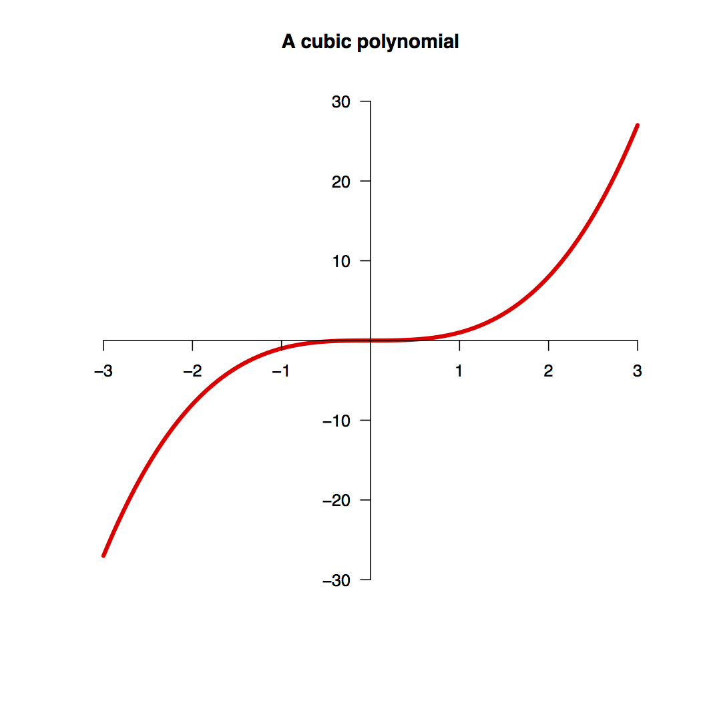

Mathematical Annotation
========================

Mathematical symbols can be annotated in R graphs using *expressions* (``expression`` function).
The possible symbols are listed under ``?plotmath``. It is also possible to include computed values in the annotation:

::

  > x <- c(1:10)
  > y <- c(11:20)
  > plot(x, y, main=expression("Fake points (" * hat(omega) * "," * bar(lambda) *
  + ") correlation"), xlab=expression(sum(hat(omega)[j]/N, j=1,10)), 
  + ylab=expression(sqrt(bar(lambda))), sub=substitute(N == k, list(k=length(x))),
  + col="red", pch=20, cex=1.5)
  
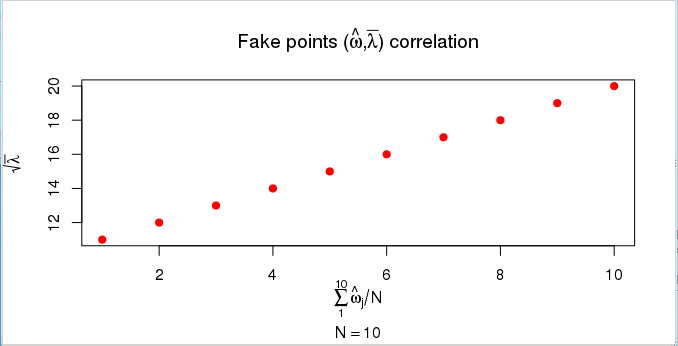
   
    
With R you can also make 3D data representations:

::

  >  demo(persp)
  ...
  
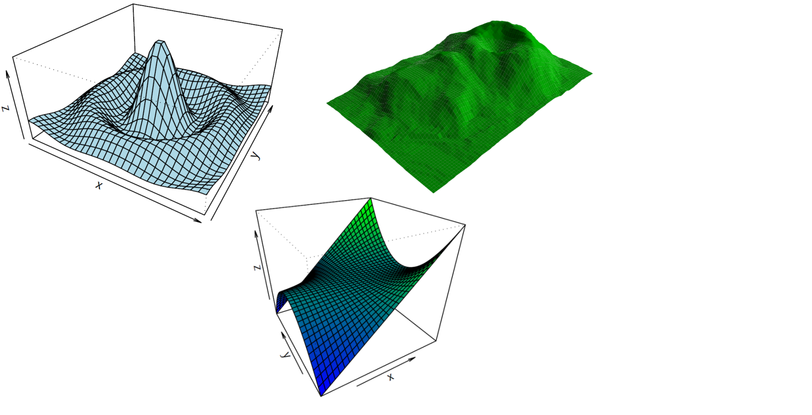
    
    
Or image representations:

:: 

  > demo(image)
  
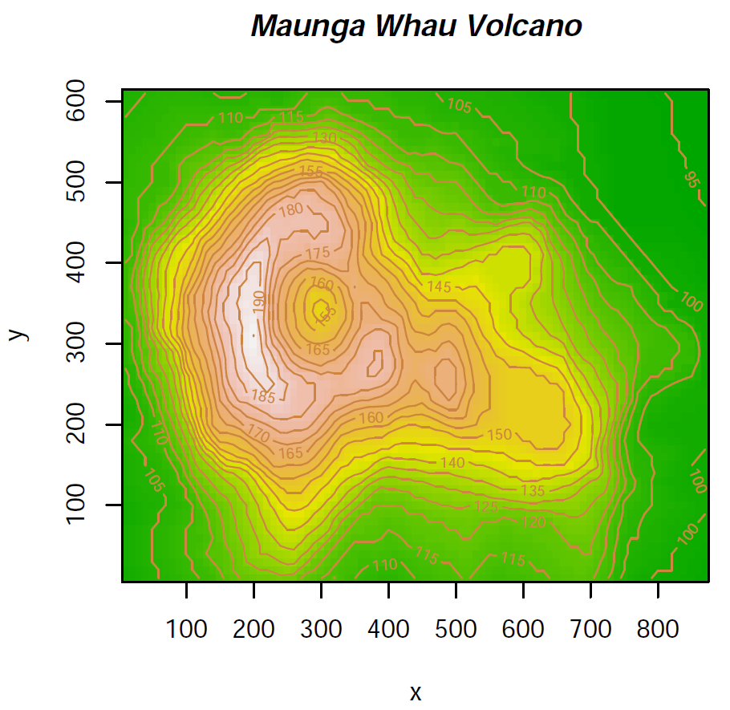

With R you can even make 3D interactive representations:

::

  > library(car)
  > attach(mtcars)
  > scatter3d(wt, disp, mpg)

  
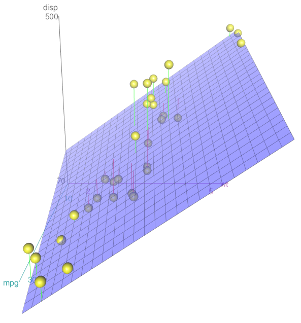

    
Making use of colours
=====================

The colours to use in R graphs can be displayed with:

::
  
  > colors()
    [1] "white"                "aliceblue"            "antiquewhite"        
    [4] "antiquewhite1"        "antiquewhite2"        "antiquewhite3"       
    ...
    [652] "yellow"               "yellow1"              "yellow2"             
    [655] "yellow3"              "yellow4"              "yellowgreen"         

  > demo(colors)
  
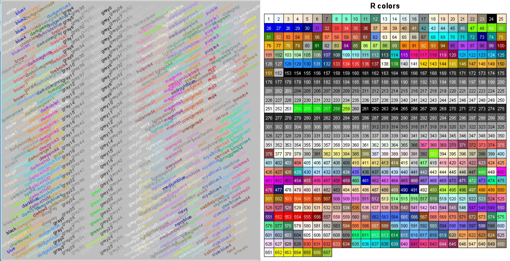

(See the Colors Chart at http://research.stowers-institute.org/efg/R/Color/Chart/index.htm)

    

However, the use of R colour functions (package ``grDevices``) is highly recommendable when plotting coloured graphs.

Colour Palettes
***************
  
A vector of *n* contiguous colours can be created using the following functions:

*rainbow(n, s = 1, v = 1, start = 0, end = max(1, n - 1)/n, alpha = 1)*

*heat.colors(n, alpha = 1)*

*terrain.colors(n, alpha = 1)*

*topo.colors(n, alpha = 1)*

*cm.colors(n, alpha = 1)*

::

  > x <- c(1:10)
  > y <- c(1:10)
  
  > par(mfrow=c(3,2))
  > plot(x,y, pch=20, col=rainbow(10), cex=3, main="rainbow(10)", cex.main=1)
  > plot(x,y, pch=20, col=heat.colors(10), cex=3, main="heat.colors(10)", cex.main=1)
  > plot(x,y, pch=20, col=terrain.colors(10), cex=3, main="terrain.colors(10)", cex.main=1)
  > plot(x,y, pch=20, col=topo.colors(10), cex=3, main="topo.colors(10)", cex.main=1)
  > plot(x,y, pch=20, col=cm.colors(10), cex=3, main="cm.colors(10)", cex.main=1)
  

The *n* parameter refers to the number of palette colours requested, and *alpha* is the number in [0,1] specified to 
get transparency (see full documentation in ``help(rainbow)``). 

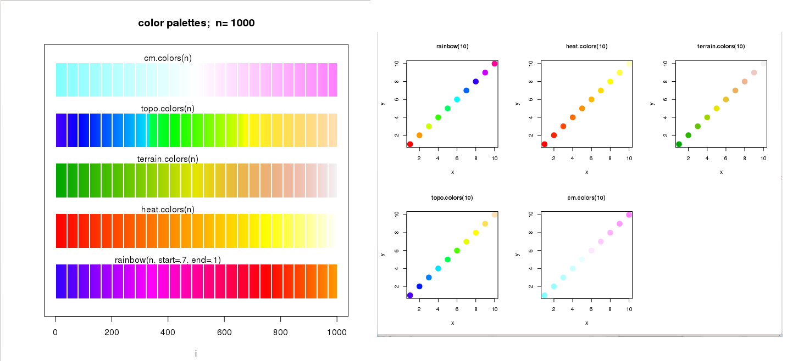
    
Colour Interpolation
*********************
There are functions in R that return functions that interpolate a set of given colours to create new 
colour palettes and colour ramps:

* **colorRamp**: returns a ‘function’ that maps values between 0 and 1 to colours.

::

  > pal <- colorRamp(c("green","blue"))			# define the function
  
  > pal(0)						# column 1: RED content
	[,1] [,2] [,3]					# column 2: GREEN content
   [1,]    0  255    0                      		# column 3: BLUE content 

  > pal(0.5)
	[,1]  [,2]  [,3]
  [1,]    0 127.5 127.5

  > pal(1)						# BLUE colour
       [,1] [,2] [,3]
  [1,]    0    0  255

  > pal(seq(0,1,len=5))
	[,1]   [,2]   [,3]
  [1,]    0 255.00   0.00
  [2,]    0 191.25  63.75
  [3,]    0 127.50 127.50
  [4,]    0  63.75 191.25
  [5,]    0   0.00 255.00

  
* **colorRampPalette**: returns a function that takes an integer argument and returns that number of colours interpolating the given sequence

::

  > x <- c(1:10)
  > y <- c(1:10)

  > mypal <- colorRampPalette(c("red","green"))
  
  > mypal(10) 
   [1] "#FF0000" "#E21C00" "#C63800" "#AA5500" "#8D7100" "#718D00" "#55AA00"
   [8] "#38C600" "#1CE200" "#00FF00"

  > plot(x,y, pch=20, col=mypal(10), 
  +      cex=3, main="colorRampPalette(c(\"red\",\"green\"))", cex.main=1)

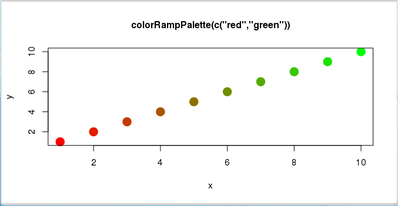

    
Additional Palettes and colour functions
******************************************

There is one package installable from CRAN with additional colour palettes (*sequential*, *diverging* and *qualitative* 
palettes), that can be used with ``colorRamp`` and ``colorRampPalette``: **RColorBrewer**

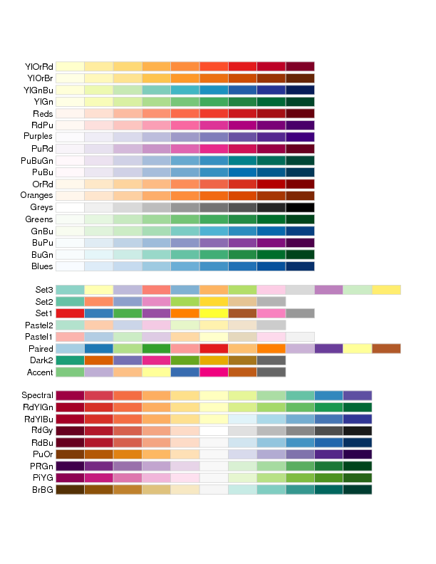

::

  > library(RColorBrewer)			# load library
  
  > colors <- brewer.pal(4, "YlOrRd")		# select 4 of the 9 colours from "YlOrRd" sequence
  
  > colors					# show colours selected
  [1] "#FFFFB2" "#FECC5C" "#FD8D3C" "#E31A1C"
  
  > mypal <- colorRampPalette(colors)		# create a new (interpolated) palette
  
  > image(volcano, col = mypal(20))		# plot image using 20 colours from new palette
  
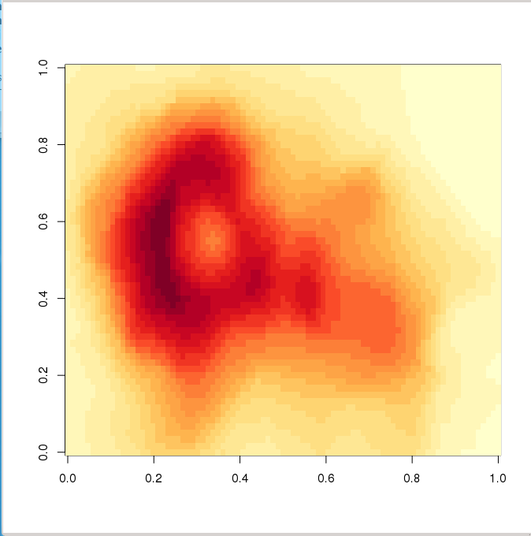
  

When plotting a scatter plot with a lot of points, two options can be used to clarify the plot: ``smoothScatter`` and 
*transparency*:

::

  > x <- rnorm(10000)
  > y <- rnorm(10000)
  > par(mfrow=c(1,2))
  > smoothScatter(x, y, main="smoothScatter function")
  > plot(x,y,col=rgb(0,0,0,0.1), pch=19, main="Scatterplot with transparency")

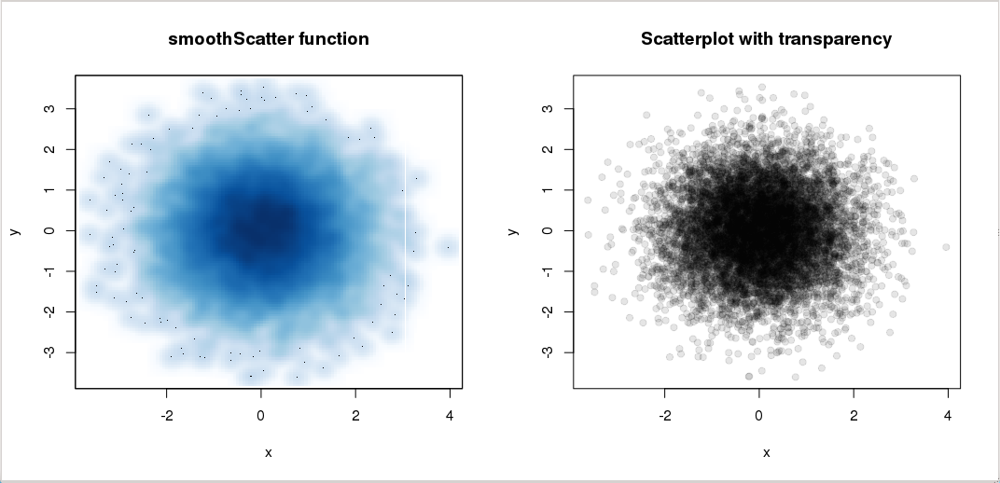

    

