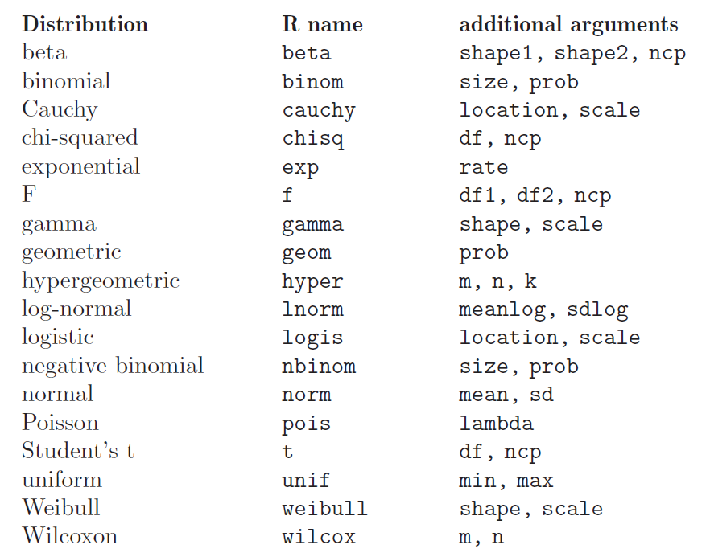
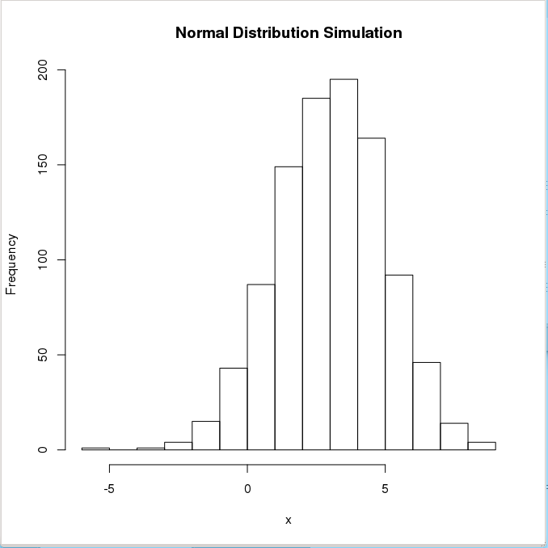
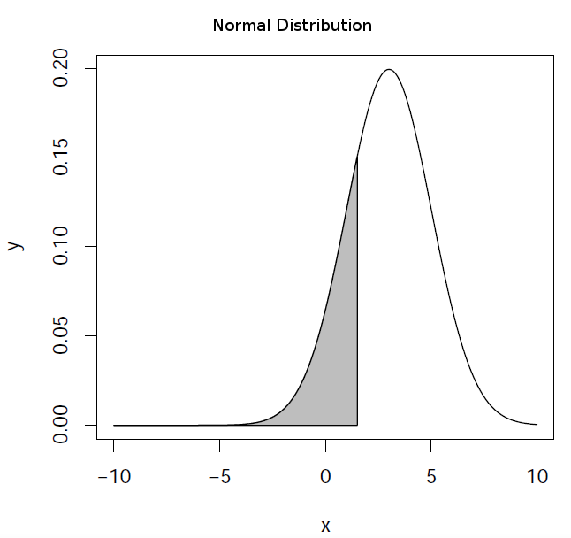

**********************
Statistical Treatment
**********************

.. role:: bmagenta
.. role:: magenta
.. highlight:: r

R contains a very comprehensive library with statistical functions, including the most common probability distributions:

	    
Associated Functions
====================

There are several functions associated to every probability distribution, and they can be accessed adding a 
prefix to the distribution name:

.. code-block::ini
   
::

  _______       _______________________________________________________________________
  
  Prefix		                    Meaning
  _______       _______________________________________________________________________
  
    d		density function
    p		distribution function (cumulative function)
    q		inverse of the distribution function (quantile function)
    r		random generation of numbers following the probability distribution
  _______       _______________________________________________________________________   

  
The arguments are obviously different for each associated function. For the *Normal Distribution*:

::

  > ?Normal
  
  Normal                  package:stats                  R Documentation

  The Normal Distribution

  Description:

     Density, distribution function, quantile function and random
     generation for the normal distribution with mean equal to ‘mean’
     and standard deviation equal to ‘sd’.

  Usage:

    dnorm(x, mean = 0, sd = 1, log = FALSE)
    pnorm(q, mean = 0, sd = 1, lower.tail = TRUE, log.p = FALSE)
    qnorm(p, mean = 0, sd = 1, lower.tail = TRUE, log.p = FALSE)
    rnorm(n, mean = 0, sd = 1)
    
  ...
  
  
1. :magenta:`dnorm(x, mean = 0, sd = 1, log = FALSE)`

It evaluates the density of the normal distribution with mean ``mean`` and standard deviation ``sd`` in ``x`` abscissa.
The normal distribution has density 

:math:`f(x) = \frac{1}{\sqrt{2 \pi} \sigma} e^{-\frac{(x - \mu)^2}{2 \sigma^2}}`

where :math:`\mu` is the mean of the distribution and :math:`\sigma` the standard deviation.

::

  > x <- seq(-10,10,by=.5)			# sequence of numbers
  > x
   [1] -10.0  -9.5  -9.0  -8.5  -8.0  -7.5  -7.0  -6.5  -6.0  -5.5  -5.0  -4.5
  [13]  -4.0  -3.5  -3.0  -2.5  -2.0  -1.5  -1.0  -0.5   0.0   0.5   1.0   1.5
  [25]   2.0   2.5   3.0   3.5   4.0   4.5   5.0   5.5   6.0   6.5   7.0   7.5
  [37]   8.0   8.5   9.0   9.5  10.0

  > y <- dnorm(x, mean=3, sd=2)			# Normal distribution with mean=3 and sd=2

  > plot(x,y,main="Normal Distribution Example")        # Plot the result
  
.. image:: images/dnorm_ejemplo.png
    :scale: 50 %
    :align: center

2. :magenta:`rnorm(n, mean = 0, sd = 1)`

Random sequence of ``n`` numbers following a normal distribution with mean ``mean`` and standard deviation ``sd``.

::

  > x <- rnorm(1000,mean=3,sd=2)		# 1000 random numbers with mean=3 and sd=2
  > summary(x)
     Min. 1st Qu.  Median    Mean 3rd Qu.    Max. 
  -3.783   1.694   3.003   3.047   4.436   9.864 

  > hist(x,main="Normal Distribution Simulation", ylab="Frequency", plot=TRUE)
  

To ensure reproducibility, it is important to set the random number seed when performing simulations:

::

  > set.seed(1000)
  > rnorm(10)
    [1] -0.44577826 -1.20585657  0.04112631  0.63938841 -0.78655436 -0.38548930
    [7] -0.47586788  0.71975069 -0.01850562 -1.37311776
  > rnorm(10)
    [1] -0.98242783 -0.55448870  0.12138119 -0.12087232 -1.33604105  0.17005748
    [7]  0.15507872  0.02493187 -2.04658541  0.21315411
  > set.seed(1000)
  > rnorm(10)
    [1] -0.44577826 -1.20585657  0.04112631  0.63938841 -0.78655436 -0.38548930
    [7] -0.47586788  0.71975069 -0.01850562 -1.37311776

3. :magenta:`pnorm(q, mean = 0, sd = 1, lower.tail = FALSE, log.p = FALSE)`

It evaluates the distribution function (area below the probability distribution) for a normal distribution with 
mean ``mean`` and standard deviation ``sd``. By default, ``lower.tail = TRUE`` returns the area in the left wing of 
the distribution (:math:`P[X \le x]`) and ``lower.tail = FALSE`` returns the right wing (:math:`P[X > x]`). 

::

  > pnorm(1.5,mean=3,sd=2)				# left wing (default)
  [1] 0.2266274

  > pnorm(1.5,mean=3,sd=2,lower.tail=FALSE)		# right wing
  [1] 0.7733726

  
The R object ``ecdf(x)`` lets us calculate and plot the *Empirical Cumulative Distribution Function* (useful when the 
cumulative distribution is not known). Let's see with an example how to plot the cumulative function in the case of a normal distribution:

::

  > par(mfrow = c(1, 2))		# define 1 row and 2 columns to plot
  > x <- rnorm(50, 2, 4)		# random numbers following normal distribution
  
  > plot(ecdf(x),verticals = TRUE, col.points = "blue",
    + col.hor = "red", col.vert = "bisque")     # plot Empirical Cumulative Distribution Function

which is equivalent to:

::

  > y <- pnorm(x, 2, 4)
  > plot(x,y, main="CDF using pnorm",
  +      col="darkolivegreen",pch=20) # plot Cumulative Distribution Function using 'pnorm'
  
.. image:: images/ecdf.png
    :scale: 60 %
    :align: center

  
4. :magenta:`qnorm(p, mean = 0, sd = 1, lower.tail = FALSE, log.p = FALSE)`

It evaluates the inverse of the distribution function (the abscissa for an area ``p`` under the probability 
distribution) for a normal distribution with mean ``mean`` and standard deviation ``sd``. By default, 
``lower.tail = TRUE`` assumes that the area is that of the left wing of the distribution and 
``lower.tail = FALSE`` assumes that is the right wing area.

::

  > qnorm(0.2266274,mean=3,sd=2)			# left wing (default)
  [1] 1.5
  
  > qnorm(0.7733726,mean=3,sd=2,lower.tail=FALSE)       # right wing
  [1] 1.5

  

    
Common probability distributions
=================================

.. code-block::ini

::

  ______________________________________________________________________________

  Distribution			Associated Function
  ______________________________________________________________________________
  
  Uniform			dunif, punif, qunif, runif
  Binomial			dbinom, pbinom, qbinom, rbinom
  Poisson			dpois, ppois, qpois, rpois
  ...				d..., p..., q..., r...
  ______________________________________________________________________________
  
  Normal			dnorm, pnorm, qnorm, rnorm
  t de Student			dt, pt, qt, rt
  chi				dchisq, pchisq, qchisq, rchisq
  F de Fisher			df, pf, qf, rf
  ...				d..., p..., q..., r...
  ______________________________________________________________________________

  
  
Example script
===============

**Purpose**: Estimation of the value of :math:`\pi` using random points generated inside a square.

**Procedure**: Calculate the ratio between the *inner* and *outer* points in a circle with radius equal to 1, 
inscribed in a square of side equal to 2 (i.e., the circle's diameter is equal to the square's side).

We save the script in a file called ``pirandom.R``:

.. code-block::ini

::

  # estimate PI by using random numbers
  #    A.squ = n = (2*r)²
  #    A.cir = n.inside = pi * r²
  #  
  #    pi = n.inside/ r² = 4*n.inside/n	
  #
  pirandom <- function(n) 		# define function
    {
      x <- runif(n,-1,1) 		# random numbers in [-1,1]
      y <- runif(n,-1,1) 		# random numbers in [-1,1]
      plot(x,y) # plot
      r <- sqrt(x*x+y*y) 		# distance to centre
      rinside <- r[r<1] 		# inside circle with r=1?
      n.inside <- length(rinside)
      print(4*n.inside/n) 		# print pi estimation
  }

The code is executed in R as follows:

::

  > source("pirandom.R")		# load the code (function) in the script
  > pirandom(1000)  			# run the function for 1000 points
  [1] 3.184				# 'pi' value estimation
  
  
.. image:: images/pirandom.jpg
    :scale: 50 %
    :align: center
  
Running code in Batch mode
--------------------------

Is it also possible to execute the previous example in batch mode. For example,
assume the following code is available in a file named ``exec_pirandom.R``:

::

  pdf("pirandom.pdf")   # define graphical output file
  source("pirandom.R")  # execute the script, making any function defined in it available
  pirandom(1000)        # execute the function
  dev.off()             # close the graphical output file

It is possible to run this code automatically using an operating system shell
command:

.. highlight:: console

::
  
  [user@pc work]$ R CMD BATCH exec_pirandom.R

This will generate text file ``exec_pirandom.Rout`` with a log capturing
everything you would see in the console if you ran the script interactively. In
particular:

- All commands executed from the script

- Any printed output, messages, or warnings

- Error messages if the script fails

- Session information and timestamps

In our example, the executed code will also generate a PDF file
``pirandom.pdf`` with the expected plot.
